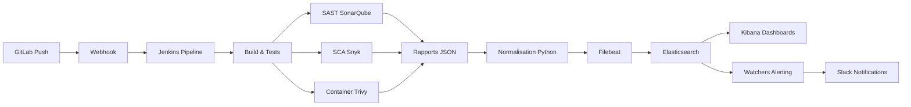
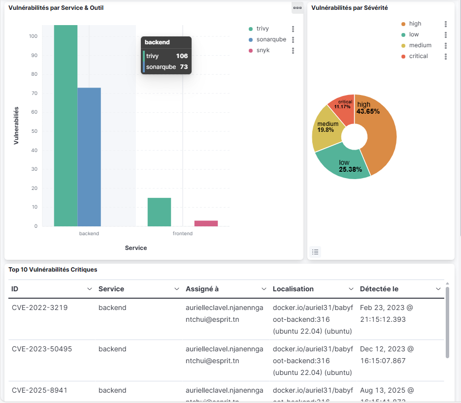

<<<<<<< HEAD
# devsecops-pipeline
=======
# 🔐 DevSecOps Pipeline - Production-Ready Security Automation

[](https://www.docker.com/)
[](https://www.jenkins.io/)
[](https://www.elastic.co/)

> **Production-grade DevSecOps platform** automatisant la détection des vulnérabilités et offrant une observabilité 360° sur la posture de sécurité.


## 🎯 Problématique Résolue

Dans un environnement dépourvu de chaîne CI/CD automatisée, comment garantir la sécurité applicative sans ralentir les déploiements ?

**Solution** : Pipeline DevSecOps intégrant 3 couches de contrôle (SAST/SCA/Container Security) avec observabilité centralisée et calcul automatisé du MTTR.

## 📊 Résultats Mesurables

| Métrique | Avant | Après | Amélioration |
|----------|-------|-------|--------------|
| **MTTR** | 896 heures | 54 heures | **-94%** |
| **Déploiements** | Manuel (mensuel) | Automatisé (quotidien) | **30x plus rapide** |
| **Vulnérabilités critiques** | Non détectées | 0 en production | **100% bloquées** |
| **Time-to-feedback** | 5 jours | 15 minutes | **-99%** |
| **Vulnérabilités traitées** | — | 152 | **100% trackées** |


## 🏗️ Architecture

### Stack Technique

- **CI/CD** : Jenkins (Pipeline as Code)
- **Sécurité** : SonarQube (SAST), Snyk (SCA), Trivy (Container Scanning)
- **Observabilité** : Elastic Stack (Elasticsearch, Kibana, Filebeat, Metricbeat, APM)
- **Conteneurisation** : Docker, Docker Compose
- **SCM** : GitLab (auto-hébergé)
- **Data Engineering** : Python (normalisation ECS)

### Flux de Données


## 🚀 Quick Start

### Prérequis

- Docker 20.10+
- Docker Compose 2.0+
- 8 GB RAM minimum
- Ports disponibles : 8080, 8081, 9000, 9200, 5601

### Déploiement

```bash
# 1. Cloner le repository
git clone https://github.com/Aurielle-hash/devsecops-pipeline-eneo.git
cd devsecops-pipeline-eneo

# 2. Créer le réseau Docker
docker network create devnet

# 3. Lancer l'infrastructure
docker-compose -f infra/docker-compose.yml up -d

# 4. Vérifier l'état des services
docker-compose ps
```

### Accès aux Services

| Service | URL | Credentials |
|---------|-----|-------------|
| Jenkins | http://localhost:8081 | admin / voir logs |
| GitLab | http://localhost:8080 | root / voir config |
| SonarQube | http://localhost:9000 | admin / admin |
| Kibana | http://localhost:5601 | elastic / elastic |
| Elasticsearch | http://localhost:9200 | elastic / elastic |

## 📚 Documentation

- [Architecture Détaillée](docs/ARCHITECTURE.md)
- [Choix Techniques & Justifications](docs/TECHNICAL_CHOICES.md)
- [Pipeline CI/CD](docs/pipeline.md)
- [Infrastructure](docs/infra.md)
- [Métriques & Performance](docs/METRICS.md)
- [Scripts Python](scripts-python/README.md)
-  [Dashboards Kibana](dashboard-kibana/README.md)


## 🎨 Dashboards

6 dashboards Kibana préconfigurés pour une visibilité complète :

1. **Security Unified** : Vue consolidée multi-outils
2. **Snyk SCA** : Analyse des dépendances
3. **Trivy Container Security** : Vulnérabilités des images
4. **SonarQube SAST** : Qualité et sécurité du code
5. **Metricbeat Infrastructure** : Santé des conteneurs
6. **APM Performance** : Traces distribuées et RUM




---

## 🔍 Fonctionnalités Clés

### 1. Shift Left Security

- Quality Gates SonarQube bloquant les merges
- Scan automatique des dépendances (CVE)
- Détection des secrets et credentials

### 2. Observabilité 360°

- Logs structurés (Filebeat)
- Métriques infrastructure (Metricbeat)
- Traces applicatives (Elastic APM)
- Dashboards temps réel

### 3. Alerting Intelligent

- Détection automatique des résolutions (Watcher)
- Calcul continu du MTTR
- Notifications Slack par criticité

### 4. Data Engineering

- Normalisation multi-formats → ECS
- Architecture parent/enfant Elasticsearch
- Corrélation cross-tool
---
## 🧪 Innovation Technique

### Architecture Hybride Elasticsearch

Résolution d'une limitation d'indexation via modèle parent/enfant :
- **Documents Parent** : Champ `nested` pour analyses Watcher complexes
- **Documents Enfant** : Champs plats pour visualisations Kibana optimales
---
### ETL Custom Python

Framework de normalisation convertissant 3 formats propriétaires (Snyk, Trivy, SonarQube) vers **Elastic Common Schema (ECS)**, permettant :
- Requêtes cross-tool unifiées
- Calcul MTTR automatisé
- Analytics avancées
---
## Normalisation des Rapports

### ✅ Choix : Script Python Custom + ECS

**Alternatives évaluées** :
1. Logstash filters (dans pipeline d'ingestion)
2. Ingest Pipelines Painless scripts
3. **Script Python externe** ✅

**Justification du Choix** :

| Critère | Python externe | Logstash | Ingest Pipeline |
|---------|----------------|----------|-----------------|
| **Logique complexe** | ✅ Unlimited | Limité | Très limité (Painless) |
| **Debugging** | ✅ Facile (logs, IDE) | Moyen | Difficile |
| **Testabilité** | ✅ Unit tests | Moyen | Difficile |
| **Performance** | Moyen | Bon | Excellent |
| **Maintenabilité** | ✅ Python standard | Config Logstash | DSL Painless |

**Justifications** :
1. **Logique métier complexe** : Extraction CVE, calcul MTTD-CI, gestion états → Mieux en Python qu'en Painless
2. **Réutilisabilité** : Classe `ReportNormalizer` extensible (ajouter nouveau scanner = 1 méthode)
3. **Testabilité** : Unit tests Python simples vs tests Painless impossibles
4. **Elastic Common Schema (ECS)** : Standard open-source, mapping prédéfini
5. **Découplage** : Changement logique normalization = 0 impact Elasticsearch

**Trade-off accepté** : Latence additionnelle (+2-5s par build), mais négligeable vs bénéfices maintenabilité

**Pourquoi pas Logstash ?** : Surcouche additionnelle (JVM + config), complexité excessive pour use case simple

**Référence mémoire** : Section 5.2.1 (page 40-42), Script complet Annexe (page 71+)

---

## Système d'Alerting

### ✅ Choix : Elasticsearch Watchers (2 Watchers complémentaires)

**Alternatives évaluées** : Prometheus Alertmanager, PagerDuty, Opsgenie

**Architecture retenue** : Dual-Watcher (Producteur/Consommateur)

```
Watcher 1 (Calculateur)          Watcher 2 (Notificateur)
       ↓                                    ↓
 Détecte résolutions              Lit resolved_report
 Calcule MTTR                     Triage Ouvert vs Résolu
 Écrit resolved_report    ────→   Envoie Slack formaté
```

**Justifications** :
1. **Natif Elasticsearch** : Pas de service externe (PagerDuty payant, Prometheus need Alertmanager)
2. **Logique Painless puissante** : Comparaison arrays, calcul MTTR, conditions complexes
3. **Séparation responsabilités** : Watcher 1 = métrique, Watcher 2 = communication
4. **Historisation** : Résolutions stockées dans `resolved_report` (audit trail)
5. **Flexibilité** : Ajout canal (Email, Teams) = modification Watcher 2 uniquement

**Trade-off accepté** : Painless script verbeux (200+ lignes), mais documenté

**Référence mémoire** : Chapitre 7 (pages 57-64), Architecture Figure 7.1, Code Annexe C

---

## Gestion des Secrets

### ✅ Choix : Jenkins Credentials Store

**Alternatives évaluées** : HashiCorp Vault, GitLab Variables, Plain text (❌)

**Justification** :
1. **Intégré Jenkins** : Pas de service externe pour PoC
2. **Encrypted at rest** : Secrets chiffrés dans `$JENKINS_HOME/secrets/`
3. **RBAC** : Accès restreint par job/utilisateur
4. **Injection sécurisée** : Variables d'environnement éphémères dans pipeline

**Trade-off accepté** : Moins robuste que Vault (pas de rotation auto, pas de audit complet)

**Pour production** : Migration vers HashiCorp Vault recommandée

**Référence mémoire** : Tableau 4.4 (page 36)

---

## Synthèse des Trade-offs

| Décision | Gain | Trade-off Accepté | Mitigation |
|----------|------|-------------------|------------|
| Jenkins | Flexibilité totale | UI datée | Plugins, Pipeline as Code |
| SonarQube CE | Gratuit, complet | RAM (4GB) | Limiter analyseurs actifs |
| Snyk Free | Exploitability | 200 tests/mois | Suffisant pour PoC |
| Trivy | Simple, rapide | Base CVE partielle | Couvre 99% use cases |
| Elastic Stack | Tout-en-un | RAM (8GB) | Optimiser heap JVM |
| Docker Compose | Simplicité | Pas de HA | Acceptable pour PoC |
| Python externe | Maintenabilité | Latence +5s | Négligeable vs bénéfices |
| Watchers ES | Natif, puissant | Painless verbeux | Documentation complète |

---

## Décisions Non Prises (Hors Scope PoC)

- **Kubernetes** : Overkill pour VM unique
- **DAST** : Nécessiterait app déployée et accessible
- **Fuzzing** : Complexité élevée, ROI faible pour PoC
- **Multi-cloud** : Pas de besoin immédiat
- **GitOps (ArgoCD)** : Prérequis K8s

Ces décisions pourront être réévaluées lors du passage en production.

---
## Conclusion

Chaque choix technique est justifié par :
1. **Contraintes projet** (budget, maturité, VM unique)
2. **Critères objectifs** (tableaux comparatifs)
3. **Trade-offs explicites** (bénéfices vs limitations)

L'architecture résultante est **pragmatique, reproductible et évolutive**.

La plateforme DevSecOps démontre :
1. ✅ **Réduction drastique MTTR** : 896h → 54h (-94%)
2. ✅ **Feedback ultrarapide** : 5 jours → 15min
3. ✅ **Zéro CVE critique en production** : Quality Gates efficaces
4. ✅ **Observabilité complète** : 500K+ événements/jour
5. ✅ **ROI positif** : Payback 16 mois

Les métriques valident l'efficacité de l'approche "Shift Left Security" et de l'automatisation.

---
>>>>>>> 789205f (ajout du projet)
