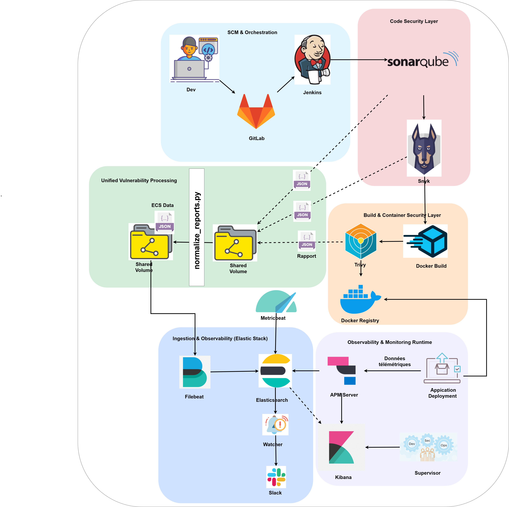
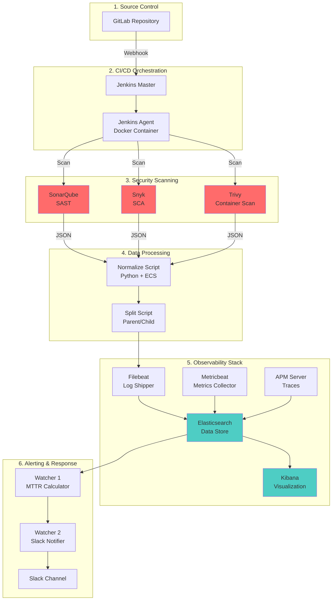
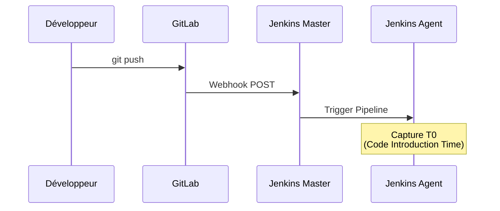
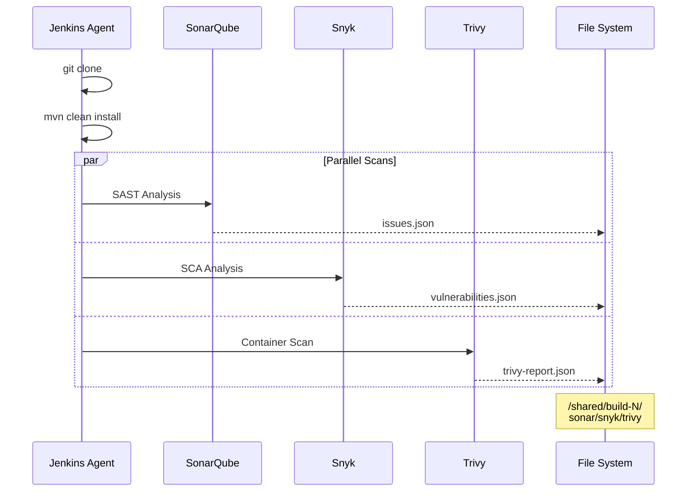
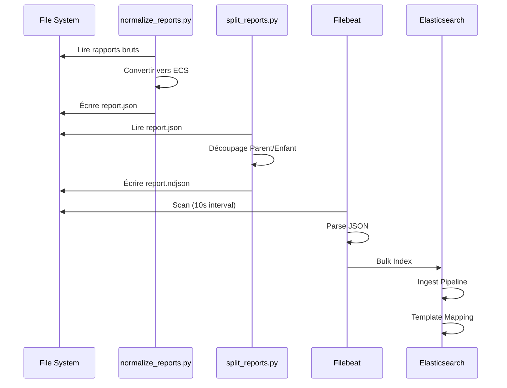
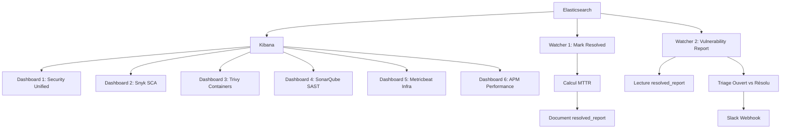
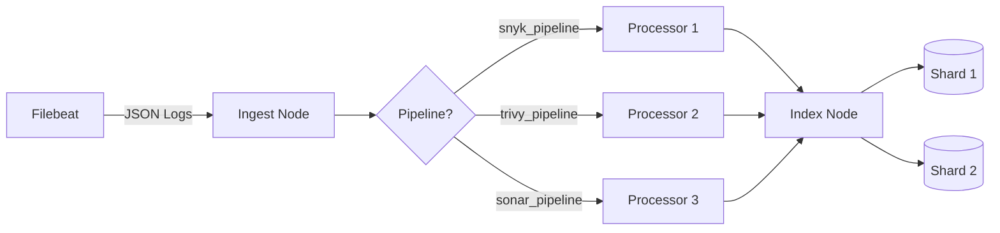

# 🏗️ Architecture Technique Détaillée

## Vue d'Ensemble

L'architecture implémente le principe **Security as Code** en intégrant les outils de sécurité directement dans le CI/CD. Elle repose sur 3 couches logiques :

1. **Couche d'Orchestration** (Jenkins + Docker)
2. **Couche de Contrôle** (Security Gates - Shift Left)
3. **Couche d'Observabilité** (Elastic Stack)

## Architecture Globale






## Flux de Données Détaillé

### Phase 1 : Déclenchement



### Phase 2 : Build & Scan



### Phase 3 : Normalisation & Ingestion



### Phase 4 : Observabilité



## Composants Détaillés

### Jenkins Agent Custom

**Dockerfile** : Basé sur `jenkins/jenkins:lts`

**Outils embarqués** :
- Docker CLI (DinD via socket mount)
- Maven 3.8.4
- Node.js 18
- PHP + Composer
- Snyk CLI
- Trivy
- Python 3 + scripts

**Justification** : Évite l'installation manuelle, garantit reproductibilité

### Elasticsearch : Architecture d'Ingestion



**3 Ingest Pipelines** :
- Renommage champs
- Enrichissement métadonnées
- Calcul scores de risque

**Index Template** :
- Mapping `nested` pour Parent
- Mapping `flat` pour Enfants
- Dynamic templates pour absorption variations

### Modèle Parent/Enfant

**Problème** : Kibana ne peut pas visualiser les champs `nested` directement.

**Solution** : Découpage en 2 types de documents partageant le même `report_id`.

```json
// Document Parent (doc_type: vulnerability_report)
{
  "report_id": "build-123",
  "vulnerabilities": [  // <- nested field
    {"id": "CVE-2024-1234", "severity": "high"},
    {"id": "SNYK-JS-2024-5678", "severity": "critical"}
  ]
}

// Documents Enfants (doc_type: vulnerability_finding)
{
  "report_id": "build-123",
  "vulnerability_id": "CVE-2024-1234",
  "severity": "high"
}
{
  "report_id": "build-123",
  "vulnerability_id": "SNYK-JS-2024-5678",
  "severity": "critical"
}
```

**Avantages** :
- Parent → Watchers (analyses complexes)
- Enfants → Kibana (visualisations)
- Corrélation via `report_id`