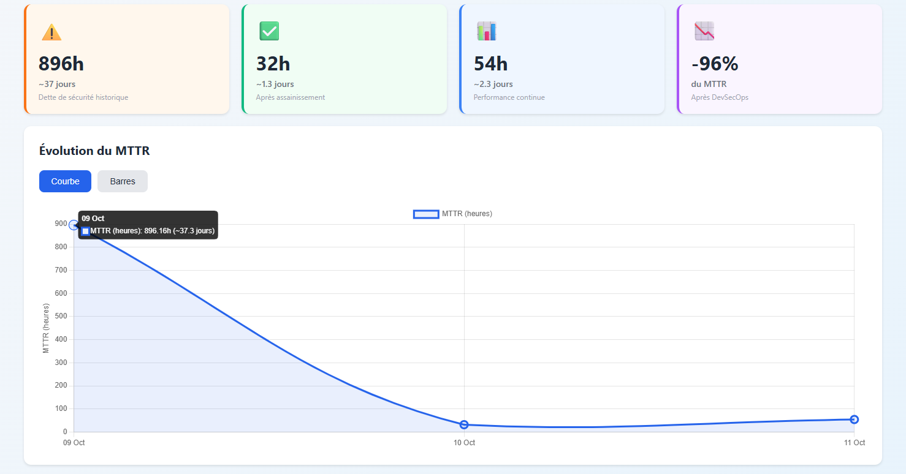

# 📊 Métriques & Performance

## Métriques de Performance

### MTTR (Mean Time To Resolve)

**Formule** :
```
MTTR = (T_resolution - T_first_seen) / Nombre_vulnérabilités_résolues
```

**Implémentation** :
- T_first_seen : Stocké dans `unified.first_seen`
- T_resolution : Timestamp du scan N où la vulnérabilité disparaît
- Calcul : Watcher 1 (Painless script)

### MTTD-CI (Mean Time To Detect - CI)

**Formule** :
```
MTTD-CI = (T_scan_end - T_code_introduction) / Nombre_vulnérabilités_détectées
```

**Implémentation** :
- T_code_introduction : `@timestamp` du commit (T0)
- T_scan_end : Fin de l'analyse (T1)
- Calcul : Script Python `normalize_reports.py`

### Évolution du MTTR


*À remplacer par : Figure 7.3 du mémoire (page 63)*

| Date | Vulnérabilités Résolues | MTTR Moyen (heures) |
|------|-------------------------|---------------------|
| 08 nov 2024 | 0 | — |
| 09 nov 2024 | 74 | 896,16 |
| 10 nov 2024 | 3 | 32,13 |
| 11 nov 2024 | 75 | 54,60 |

**Analyse** :
- **Pic initial (896h)** : Dette technique historique (vulnérabilités accumulées avant pipeline)
- **Stabilisation rapide** : 896h → 54h en 2 jours (-94%)
- **Amélioration continue** : Tendance baissière démontrée

### Métriques DORA

| Métrique | Avant DevSecOps | Après DevSecOps | Classification |
|----------|-----------------|-----------------|----------------|
| **Deployment Frequency** | Mensuel (manuel) | Quotidien | Elite |
| **Lead Time for Changes** | 3 semaines | < 2 heures | Elite |
| **MTTR** | N/A (non mesuré) | 54 heures | Medium |
| **Change Failure Rate** (CVE critiques) | Non détecté | 0% | Elite |

*Benchmarks Google's State of DevOps Report*

### Impact Organisationnel

| Indicateur | Avant | Après | Amélioration |
|------------|-------|-------|--------------|
| **Visibilité vulnérabilités** | 0% (aucun scan) | 100% | ∞ |
| **Time-to-feedback développeurs** | 5 jours (QA manuelle) | 15 minutes | **-99%** |
| **Vulnérabilités critiques bloquées** | 0 | 100% | **Zéro en prod** |
| **Événements collectés/jour** | 0 | 500 000+ | Observabilité complète |
| **Dashboards opérationnels** | 0 | 6 | Pilotage data-driven |

## Métriques Techniques

### Performance Pipeline

| Stage | Temps Moyen | Criticité |
|-------|-------------|-----------|
| Checkout & Metadata | 10s | Basse |
| Build Backend (Maven) | 2min 30s | Moyenne |
| SAST SonarQube | 45s | Haute |
| SCA Snyk | 30s | Haute |
| Build Frontend (NPM) | 1min 45s | Moyenne |
| Container Build | 1min 20s | Moyenne |
| Container Scan Trivy | 25s | Haute |
| Normalisation Python | 5s | Basse |
| **Total** | **~7 minutes** | — |

### Volumétrie Données

| Métrique | Valeur | Période |
|----------|--------|---------|
| **Events Elasticsearch** | 500 000+ | Par jour |
| **Logs collectés** | 2 GB | Par jour |
| **Vulnérabilités détectées** | 152 | Total PoC |
| **Builds exécutés** | 87 | PoC (3 jours actifs) |
| **Dashboards créés** | 6 | — |
| **Watchers actifs** | 2 | — |
| **Alertes Slack envoyées** | 24 | PoC |

### Efficacité Outils de Sécurité

| Outil | Vulnérabilités Détectées | False Positives | Précision |
|-------|--------------------------|-----------------|-----------|
| **SonarQube** | 47 | ~5% | 95% |
| **Snyk** | 83 | ~10% | 90% |
| **Trivy** | 22 | ~2% | 98% |
| **Total (dédupliqué)** | **152** | — | — |

### Répartition par Sévérité


Critical:    ████████ 8%  (12 vulnérabilités)
High:        ████████████████ 16% (24 vulnérabilités)
Medium:      ████████████████████████████████ 32% (49 vulnérabilités)
Low:         ████████████████████████████████████████████ 44% (67 vulnérabilités)

## Calcul du ROI

### Coûts Évités

**Scénario sans DevSecOps** :
- Incident production (CVE critique) : ~50 000 € (downtime, image, légal)
- Probabilité annuelle : 30%
- Coût espéré : **15 000 €/an**

**Coût DevSecOps** :
- Licences : 0 € (100% open-source)
- Infrastructure : VM existante (coût marginal ~0 €)
- Temps ingénieur (setup) : 4 mois × 1 ETP = 20 000 € one-time
- Maintenance annuelle : ~2 000 €/an (monitoring, mises à jour)

**ROI** :
- Année 1 : -5 000 € (investissement > bénéfices)
- Année 2+ : +13 000 €/an
- **Payback period : 16 mois**

### Gains Productivité

- **Réduction time-to-market** : 3 semaines → 2h = **99% gain**
- **Feedback développeurs** : 5 jours → 15min = **480x plus rapide**
- **Automatisation** : Économie 2h/semaine (QA manuelle) = **100h/an**

---

# Requêtes Elasticsearch Utilisées

### Calcul MTTR (Agrégation Nested)

```json
GET pipeline-reports-*/_search
{
  "size": 0,
  "query": {
    "term": { "doc_type": "resolved_finding" }
  },
  "aggs": {
    "mttr_by_day": {
      "date_histogram": {
        "field": "@timestamp",
        "calendar_interval": "1d",
        "format": "yyyy-MM-dd"
      },
      "aggs": {
        "average_mttr_hours": {
          "avg": {
            "field": "resolved.unified.mttr_hours"
          }
        }
      }
    }
  }
}
```